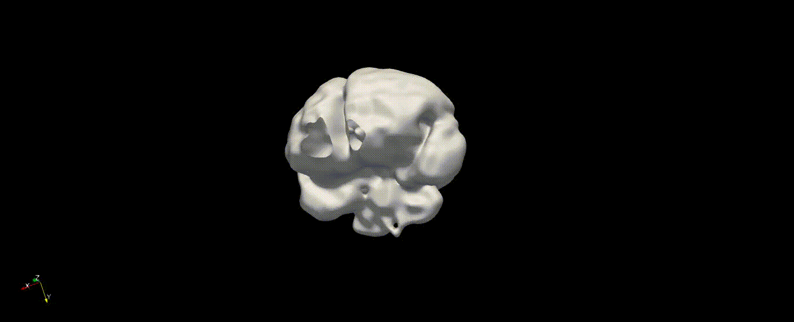
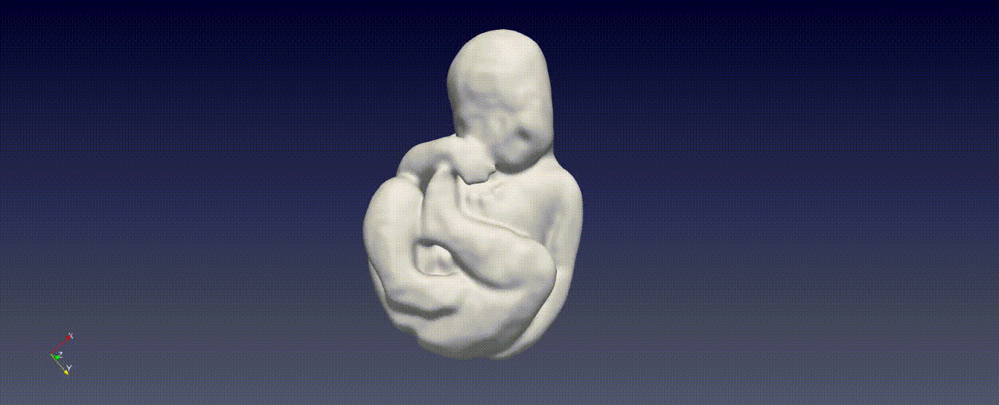

- [Development Branch](https://github.com/GalDude33/Fetal-MRI-Segmentation/tree/prev_truth)

- [Experiments Branch](https://github.com/GalDude33/Fetal-MRI-Segmentation/tree/adapt)

- [Augmentations Notebook](https://github.com/GalDude33/Fetal-MRI-Segmentation/blob/adapt/notebooks/Check_Augmentations.ipynb)

### Fetal Total-Body and Brain 3D Segmentation in MRI scans with limited datasets.

- 3D and 2D segmentation.
- Implemented Advanced Augmentation techniques.
- Achieving results below Radiologist Inter & Intra Observer variability.
- Option to Utilize previous-slice segmentation to improve performance on hard samples.

### Training 

* Install Tensorflow & Keras

* Install dependencies: 
pip install -r requirements.txt

* To run training:
Config currently in dict inside brats/train_fetal.py
```
$ python -m brats.train_fetal --config_dir <config_dir>
```
Where <config_dir> is the folder containing the training configurations (or will be creatad to)

### Write prediction images from the validation data
In the training above, part of the data was held out for validation purposes. 
To write the predicted label maps to file:
```
$ python -m brats.predict --config_dir <config_dir>
```
The predictions will be written in the ```<config_dir>/prediction``` folder along with the input data and ground truth labels for comparison.

### More Instructions and Explanations in the [Wiki](../../wiki)!

### Cool Results

##### 3D Model of the segmented fetal brain

##### 3D Model of the segmented fetal body

##### Segmentation of fetal brain

##### Segmentation of fetal brain (only border)

##### Segmentation of fetal body

